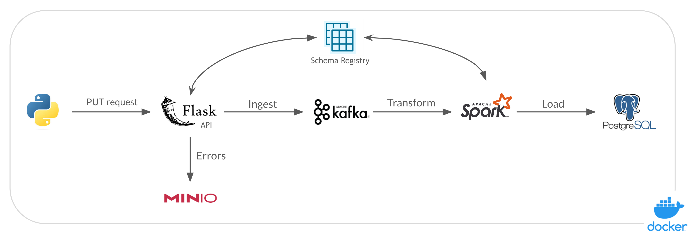
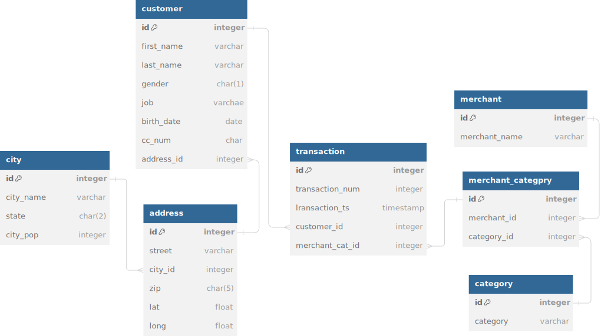

# streaming pipeline

## Introduction

With this project, I constructed an streaming pipeline for processing credit card transactions
1. The pipeline receives transactions via PUT requests
2. Transaction data received is validated
   - If it fails validation, it gets stored in an storage bucket
   - If it passes validation, it gets ingested into Kafka
3. Transaction data is transformed into the desired form before storing it in the database

## The dataset
This credit card transaction dataset containing legitimate and fraud transactions from the duration 1st Jan 2019 - 31st Dec 2020. It covers credit cards of 1000 customers doing transactions with a pool of 800 merchants.

Access to the dataset is accessible on [Kaggle](https://www.kaggle.com/datasets/kartik2112/fraud-detection).

## Built With
- Dataset: [Kaggle](https://www.kaggle.com/datasets/kartik2112/fraud-detection)
- Streaming: Kafka
- Data Lake: Minio
- Database: Postgresql
- Transformation: Spark
- CICD: GitHub Actions
- Programming Language: Python and SQL

## Architecture

- All tools are running in docker containers

## Data Model

